# 💼 Employee Management System – SQL Project

This project demonstrates a complete **SQL-based Employee Management System** implemented in **Microsoft SQL Server (SSMS)** using real-time database concepts. It includes table creation, views, functions, stored procedures, triggers, transactions, and optimization techniques — all backed by practical screenshots.

---
## 📂 Project Structure

EmployeeManagementSystem/
│
├── employee_management_system.sql # Main SQL file with all queries
├── LICENSE # MIT License
├── README.md # This file
└── Screenshots/ # Output screenshots

---

## 🚀 Features Implemented

### 🧱 1. Table Creation
```sql
CREATE TABLE Department (
    DepartmentID INT PRIMARY KEY IDENTITY,
    DepartmentName VARCHAR(100)
);

CREATE TABLE Employee (
    EmployeeID INT PRIMARY KEY IDENTITY,
    Name VARCHAR(100),
    Salary DECIMAL(10, 2),
    DepartmentID INT FOREIGN KEY REFERENCES Department(DepartmentID),
    HireDate DATE DEFAULT GETDATE()
);
```
📸 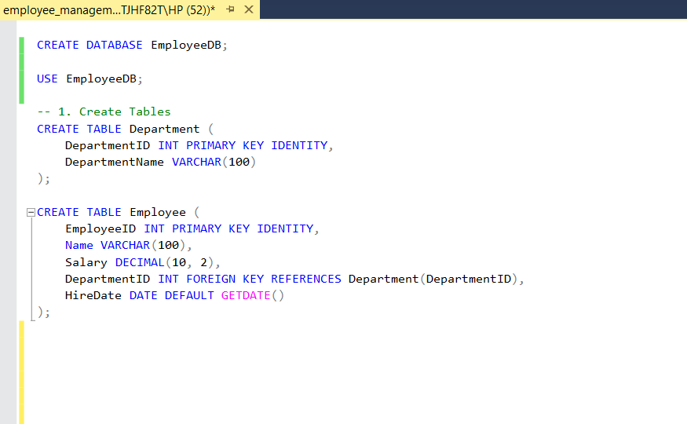

---

### 🗃️ 2. Insert Sample Data
```sql
INSERT INTO Department (DepartmentName) VALUES ('HR'), ('IT'), ('Finance');

INSERT INTO Employee (Name, Salary, DepartmentID) VALUES
('Alice', 50000, 1),
('Bob', 70000, 2),
('Charlie', 60000, 3),
('David', 40000, 2);
```
📸 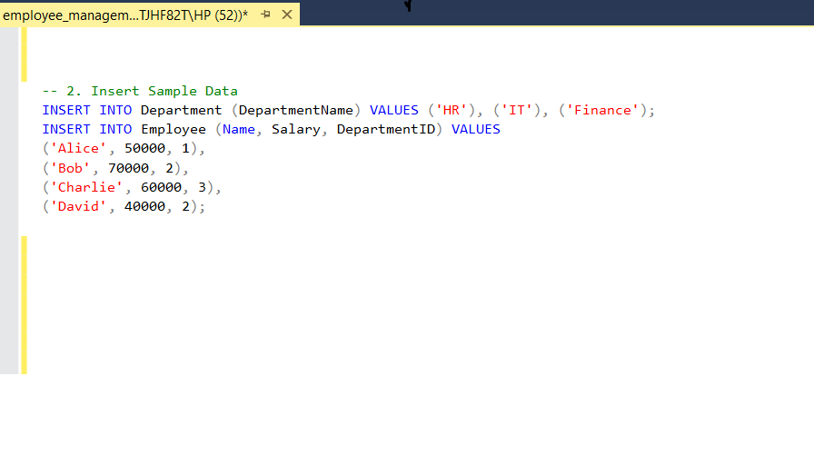

---

### 👁️ 3. Create View
```sql
CREATE VIEW vw_EmployeeDetails AS
SELECT e.EmployeeID, e.Name, e.Salary, d.DepartmentName, e.HireDate
FROM Employee e
JOIN Department d ON e.DepartmentID = d.DepartmentID;
```
📸 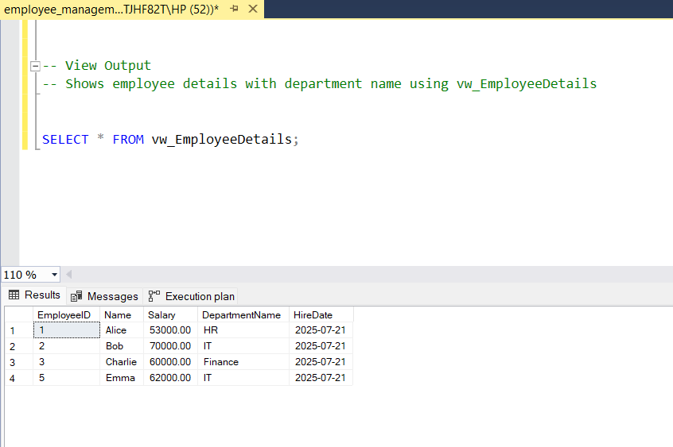

---

### 💡 4. CTE – Top Earners
```sql
WITH TopEarners AS (
    SELECT Name, Salary
    FROM Employee
    WHERE Salary > 50000
)
SELECT * FROM TopEarners;
```
📸 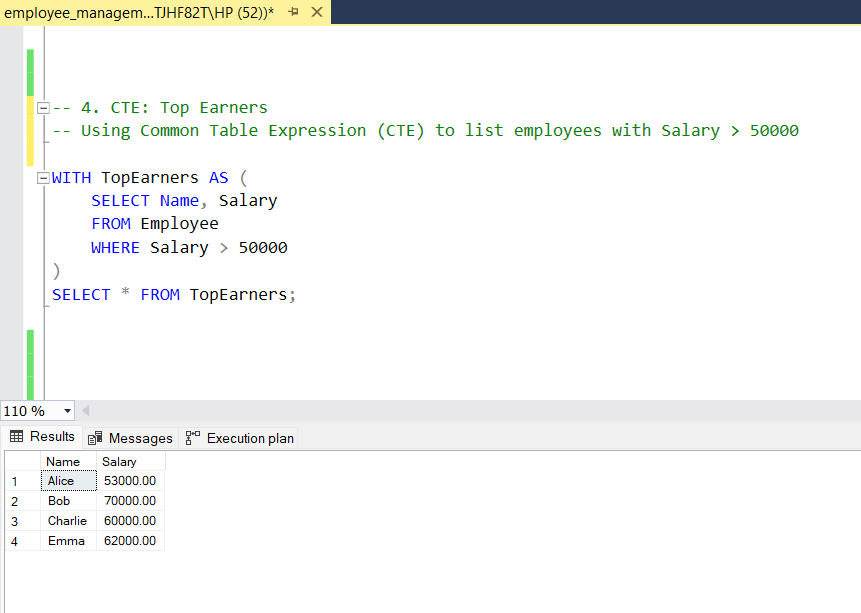

---

### 🔁 5. Data Type Conversion
```sql
SELECT Name, CAST(Salary AS VARCHAR(10)) AS SalaryText FROM Employee;
```
📸 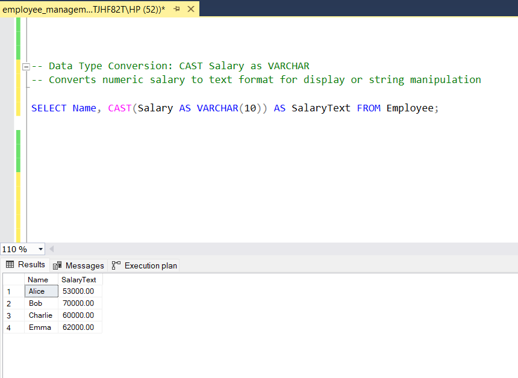

---

### ⚙️ 6. Stored Procedure – Add Employee
```sql
CREATE PROCEDURE AddEmployee
    @Name VARCHAR(100),
    @Salary DECIMAL(10,2),
    @DepartmentID INT,
    @Message VARCHAR(100) OUTPUT
AS
BEGIN
    INSERT INTO Employee (Name, Salary, DepartmentID)
    VALUES (@Name, @Salary, @DepartmentID);
    SET @Message = 'Employee added successfully';
END;
```
📸 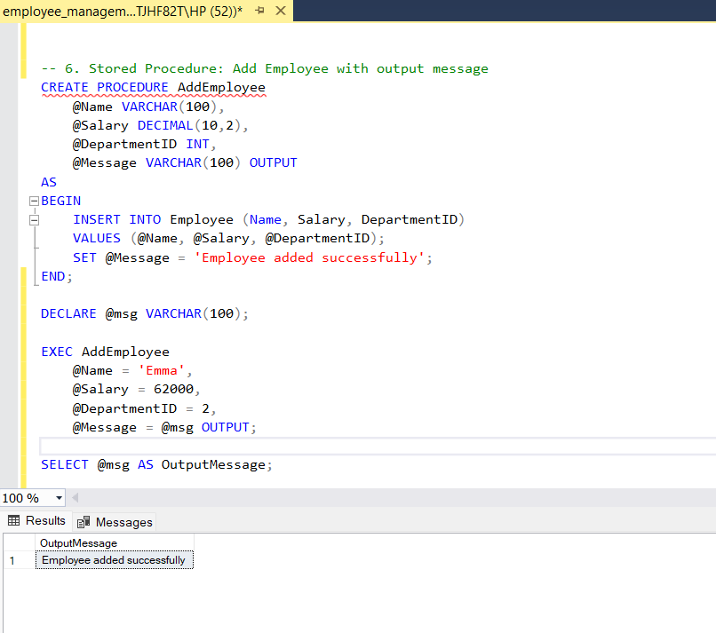

---

### 🔧 7. Scalar Function – Annual Salary
```sql
CREATE FUNCTION fn_GetAnnualSalary(@MonthlySalary DECIMAL(10,2))
RETURNS DECIMAL(10,2)
AS
BEGIN
    RETURN @MonthlySalary * 12;
END;
```
📸 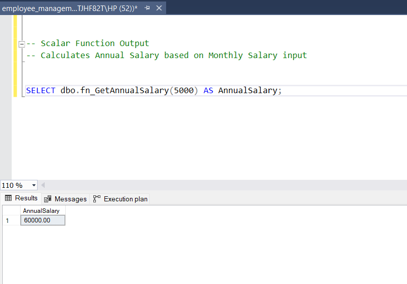

---

### 📊 8. Table-Valued Function – Employees by Department
```sql
CREATE FUNCTION fn_GetEmployeesByDept(@DeptID INT)
RETURNS TABLE
AS
RETURN (
    SELECT * FROM Employee WHERE DepartmentID = @DeptID
);
```
📸 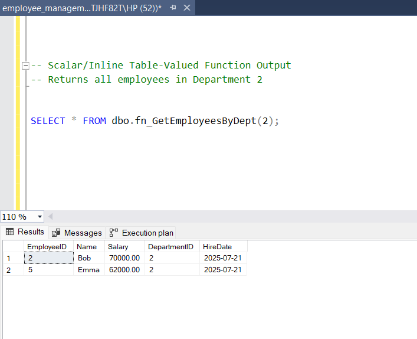

---

### 🔐 9. AFTER Trigger – Insert Log
```sql
CREATE TRIGGER trg_AfterInsertEmployee
ON Employee
AFTER INSERT
AS
BEGIN
    INSERT INTO EmployeeLog (EmployeeID, ActionType)
    SELECT EmployeeID, 'INSERT' FROM INSERTED;
END;
```
📸 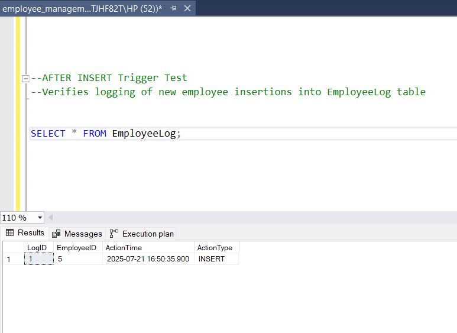

---

### ❌ 10. INSTEAD OF DELETE Trigger – Restrict Deletion
```sql
CREATE TRIGGER trg_InsteadOfDelete
ON Employee
INSTEAD OF DELETE
AS
BEGIN
    DELETE FROM Employee
    WHERE EmployeeID IN (SELECT EmployeeID FROM DELETED WHERE Salary <= 60000);
END;
```
📸 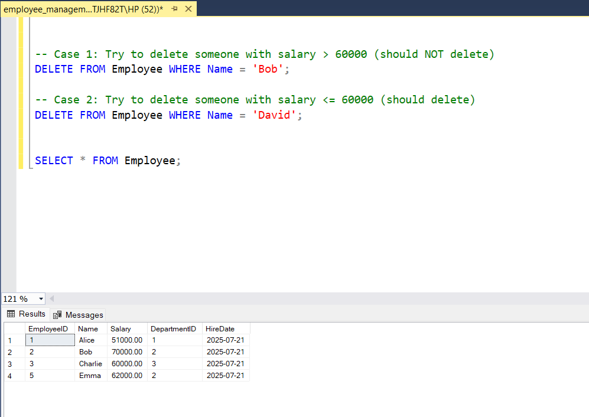

---

### 💳 11. Transaction with Isolation Level
```sql
SET TRANSACTION ISOLATION LEVEL READ COMMITTED;
BEGIN TRANSACTION;
    UPDATE Employee SET Salary = Salary + 1000 WHERE Name = 'Alice';
COMMIT;
```
📸 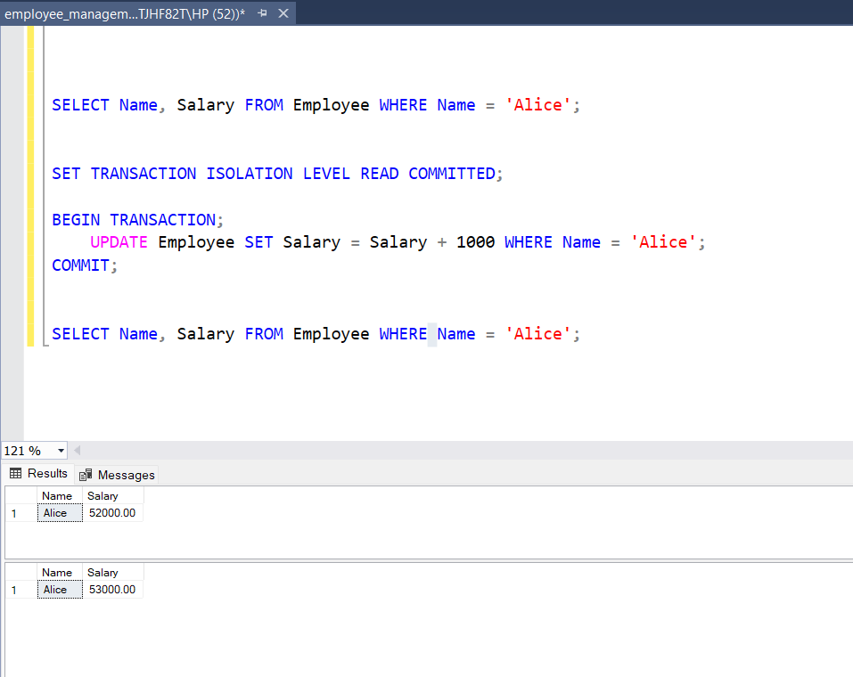

---

### 📌 12. Indexes – Clustered & Non-Clustered
```sql
CREATE CLUSTERED INDEX idx_EmployeeID ON Employee(EmployeeID);
CREATE NONCLUSTERED INDEX idx_EmployeeName ON Employee(Name);
```
📸 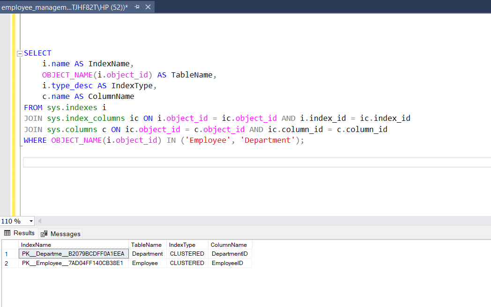

---

### ⚡ 13. Execution Plan Optimization
```sql
-- Before Optimization
SELECT * FROM Employee;

-- After Optimization
SELECT e.Name, e.Salary, d.DepartmentName
FROM Employee e
JOIN Department d ON e.DepartmentID = d.DepartmentID
WHERE e.Salary > 50000;
```
📸 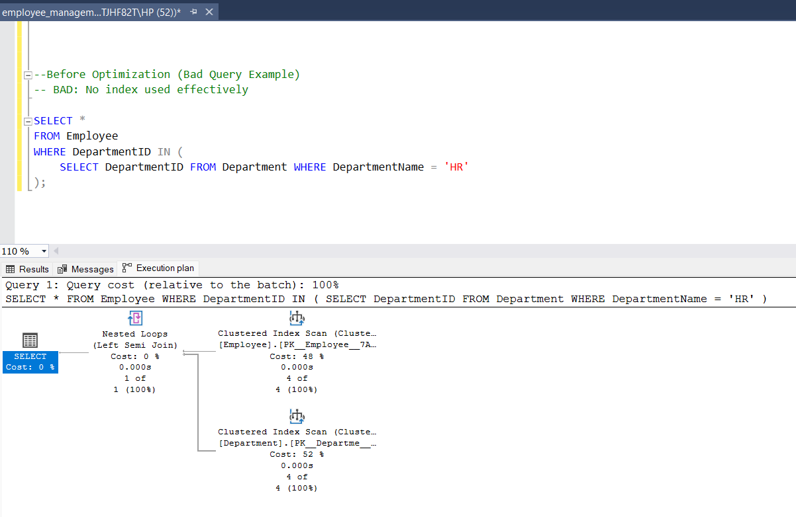  
📸 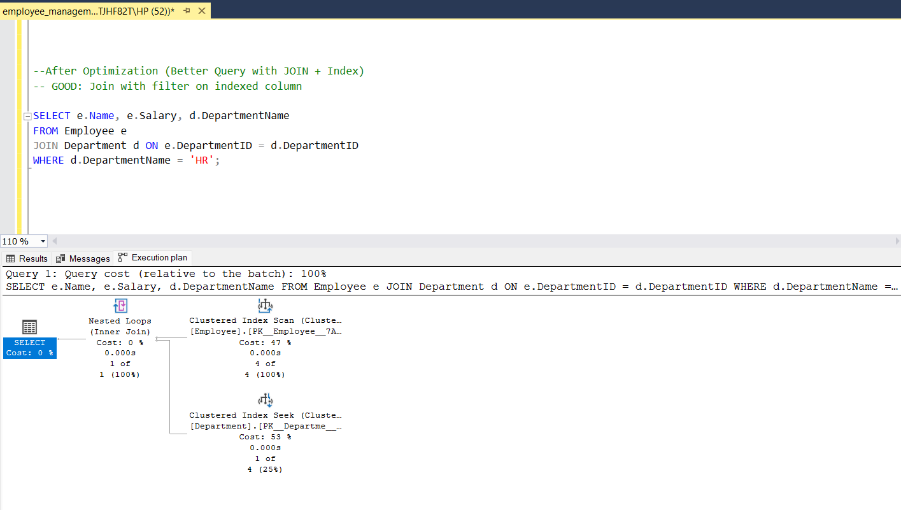

---

## 📦 How to Use

1. Clone this repo or download the `.sql` file.
2. Open SSMS and run the script.
3. Explore screenshots in the `Screenshots/` folder for visual output.
4. Modify and test queries to learn SQL effectively.

---

## 📜 License

This project is licensed under the MIT License.  
See [`LICENSE`](LICENSE) for full details.

---

## 🙌 Author

**Nishma P**  
BCA Graduate | SQL Enthusiast | [GitHub Profile](https://github.com/nishmacodes)

---
